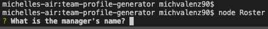

 

   

  # team-profile-generator

  ## Description 
  The Team Profile Generator application allows users to create a roster of employees to track important employee information such as emails and phone numbers. 
 

  ## Table of Contents

  * [Installation](#Installation)
  * [Usage](#Usage)
  * [Contributions](#Contributions)
  * [Testing](#Testing)
  * [License](#License)
  * [Questions](#Questions)

  ## Installation
  The user must clone the remote repository onto their computer and use the terminal to run the generator.

  ## Usage
  To create quick and structured employee rosters.

  ## Contributions
  No contributions.

  ## Testing 
  After cloning the remote repository onto your computer open in desired code editor and use the terminal on the Roster.js file to interact. Test the project by answering the prompt questions and creating a test roster.

  

  ## License 
  This project has an MIT license.
  https://opensource.org/licenses/MIT

 
  

  ## Questions
  Need to reach me?
  * Email: michvalenz27@gmail.com
  * [GitHub](https://github.com/MichValenz/team-profile-generator)

   ## Walkthrough Video
   https://watch.screencastify.com/v/D8pW71l7hwvyDEAbRSCP

   

       